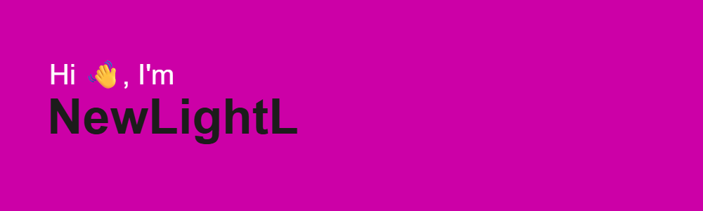

<h1>𝙋𝙮𝙩𝙝𝙤𝙣 𝙙𝙚𝙫𝙚𝙡𝙤𝙥𝙚𝙧 𝙛𝙧𝙤𝙢 𝙍𝙪𝙨𝙨𝙞𝙖𝙣</h1>

<h2>My stats</h2>

 

<h2>Smart people said...</h2>

<h2>About me</h2>

- My name is Lev🦁
- I born and live in Russia, St.Petersburg🌍
- I love coke is SOOOOOO much🥤

I started learning programming in December 2023 when I was 14. I really like it. I want to connect my life with this in the future.
I have experience working on freelance exchanges. I made parsers, telegram bots, small sites and the like
